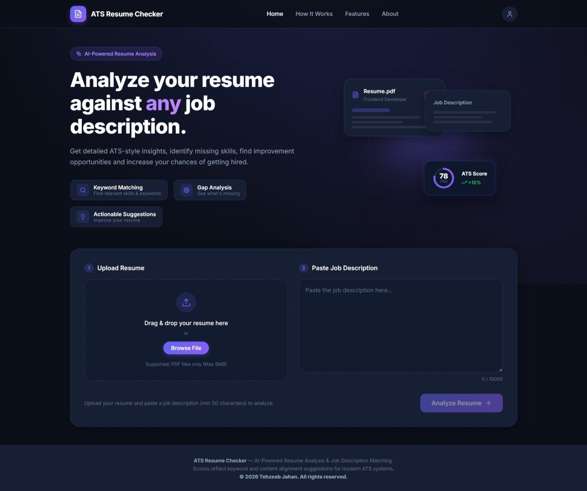
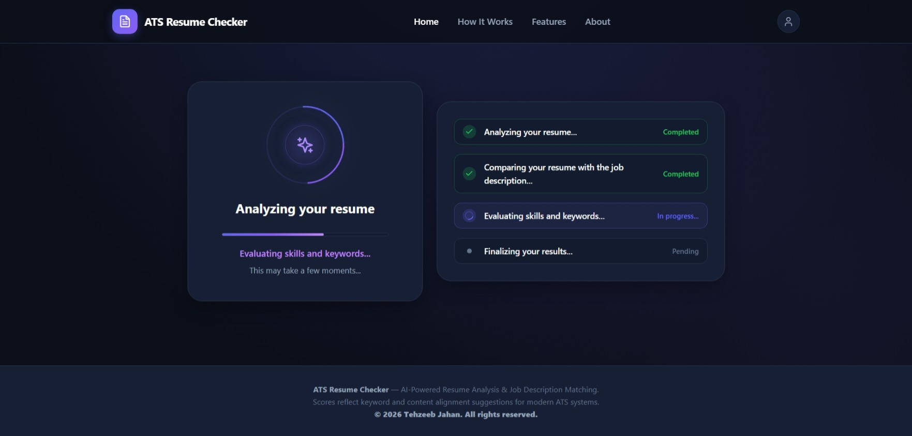
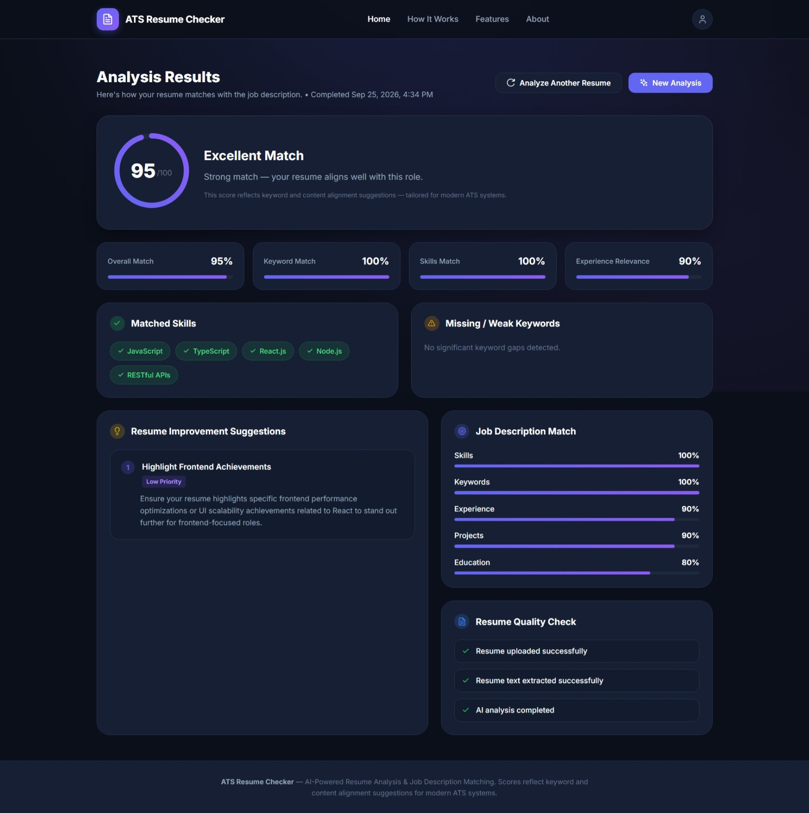
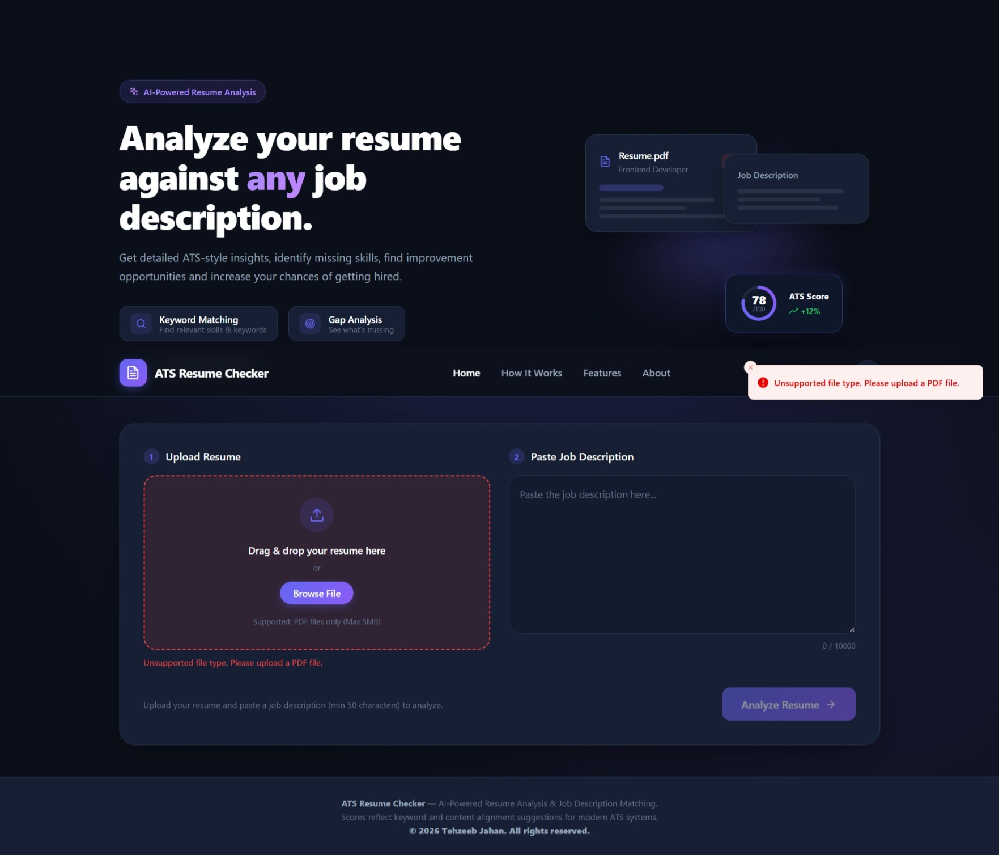
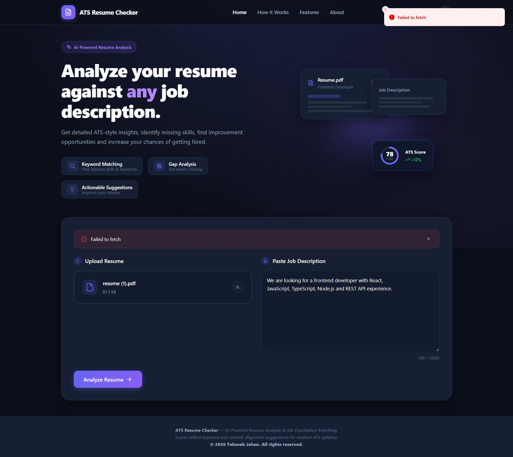

# ATS Resume Checker


A full-stack ATS Resume Checker that analyzes a resume against a job description and provides an ATS compatibility score, matched skills, missing keywords, job-match metrics, and actionable improvement suggestions using Google Gemini AI.

## Screenshots

### Resume Analyzer



### Analysis Progress



### Analysis Results



### Only PDF files validation



### Analysis/API Error




---

## Overview

ATS Resume Checker helps job seekers understand how well their resume matches a specific job description.

The application:

* Accepts a PDF resume
* Extracts text from the uploaded resume
* Compares the resume with the provided job description
* Uses Google Gemini AI to analyze skills, keywords, experience, projects, and education
* Calculates an overall ATS score
* Identifies matched skills
* Identifies missing keywords
* Provides job-match metrics
* Generates actionable improvement suggestions
* Stores analysis results in MongoDB
* Removes the temporary uploaded resume after processing

The project is built as a full-stack application with a React + TypeScript frontend and a Node.js + Express backend.

---

## Features

### Resume Analysis

* PDF resume upload
* 5 MB maximum file size
* PDF text extraction
* Job description validation
* AI-powered resume analysis
* ATS compatibility score from 0–100

### AI-Powered Matching

The application evaluates:

* Skills match
* Keyword match
* Experience relevance
* Projects relevance
* Education relevance

It also provides:

* Matched skills
* Missing keywords
* Resume improvement suggestions
* Suggestion priority levels

### User Interface

* Clean responsive interface
* Resume upload workflow
* Job description input
* Analysis progress screen
* Results dashboard
* Metric cards
* Matched and missing keyword sections
* Improvement suggestions
* Toast notifications
* Analyze another resume workflow

### Backend

* REST API built with Express
* PDF upload handling with Multer
* PDF text extraction
* Google Gemini AI integration
* MongoDB persistence with Mongoose
* Request validation
* Temporary file cleanup
* Retry handling for temporary Gemini API failures

---

## Tech Stack

### Frontend

* React 19
* TypeScript
* Vite
* Sonner

### Backend

* Node.js
* Express 5
* MongoDB
* Mongoose
* Multer
* pdf-parse
* Zod
* Google Gemini API
* dotenv
* CORS

### Development Tools

* Git
* GitHub
* Nodemon
* Postman

---

## Project Architecture

```text
User
  │
  ▼
React + TypeScript Frontend
  │
  │ POST /api/analyze
  ▼
Express Backend
  │
  ├── Multer
  │     └── Temporary PDF upload
  │
  ├── PDF Parser
  │     └── Extract resume text
  │
  ├── Gemini AI
  │     └── Resume + Job Description analysis
  │
  ├── ATS Score Calculation
  │
  └── MongoDB
        └── Store analysis result
```

---

## How It Works

### 1. Upload Resume

The user uploads a PDF resume.

The backend temporarily stores the uploaded file using Multer.

### 2. Enter Job Description

The user provides the job description they want to compare their resume against.

The current minimum job description length is **50 characters**.

### 3. Extract Resume Text

The backend extracts text from the uploaded PDF.

Text-based PDFs are required for successful extraction.

### 4. Analyze with Gemini

The extracted resume text and job description are sent to Google Gemini.

The AI evaluates:

* Skills
* Keywords
* Experience
* Projects
* Education

The AI response is validated using Zod before being used by the backend.

### 5. Calculate ATS Score

The backend calculates the final ATS score using the analysis categories:

```text
Skills       → 30%
Keywords     → 30%
Experience   → 20%
Projects     → 10%
Education    → 10%
```

The final score is calculated on a scale of **0–100**.

### 6. Save Analysis

The analysis result is stored in MongoDB.

### 7. Clean Up Upload

The uploaded PDF is temporary.

After processing, the backend deletes the uploaded file from the `uploads` directory.

This means resumes are not intentionally kept as permanent uploaded files by the current implementation.

---

## Project Structure

```text
ATS-Resume-checker-ts/
│
├── client/
│   ├── public/
│   ├── src/
│   │   ├── components/
│   │   ├── constants/
│   │   ├── hooks/
│   │   ├── services/
│   │   ├── types/
│   │   ├── utils/
│   │   ├── App.tsx
│   │   └── main.tsx
│   ├── .env.example
│   ├── package.json
│   └── vite.config.ts
│
├── server/
│   ├── src/
│   │   ├── config/
│   │   │   └── db.js
│   │   ├── controllers/
│   │   │   └── analysis.controller.js
│   │   ├── middleware/
│   │   │   └── upload.middleware.js
│   │   ├── models/
│   │   │   └── analysis.model.js
│   │   ├── routes/
│   │   │   └── analysis.routes.js
│   │   └── services/
│   │       ├── ai.service.js
│   │       └── pdf.service.js
│   ├── .env.example
│   ├── package.json
│   └── server.js
│
├── screenshots/
│   ├── home.png
│   ├── analyzing.png
│   └── results.png
│
├── .gitignore
└── README.md
```

---

## Getting Started

Follow the steps below to run the project locally.

### Prerequisites

Make sure you have installed:

* Node.js
* npm
* MongoDB
* Git

You will also need a Google Gemini API key.

---

## Installation

Clone the repository:

```bash
git clone https://github.com/Tehzeeb2487/ATS-Resume-checker.git
```

Navigate into the project:

```bash
cd ATS-Resume-checker-ts
```

---

## Frontend Setup

Navigate to the client directory:

```bash
cd client
```

Install dependencies:

```bash
npm install
```

Create a `.env` file:

```env
VITE_API_BASE_URL=http://localhost:5000
```

Start the development server:

```bash
npm run dev
```

The frontend will be available at the local Vite development URL shown in your terminal.

---

## Backend Setup

Open another terminal and navigate to the server:

```bash
cd server
```

Install dependencies:

```bash
npm install
```

Create a `.env` file:

```env
MONGODB_URI=your_mongodb_connection_string
PORT=5000
GEMINI_API_KEY=your_gemini_api_key
```

Start the backend:

```bash
npm start
```

For development with Nodemon:

```bash
npx nodemon server.js
```

The backend runs on:

```text
http://localhost:5000
```

---

## Environment Variables

### Frontend

Create:

```text
client/.env
```

Required variable:

```env
VITE_API_BASE_URL=http://localhost:5000
```

### Backend

Create:

```text
server/.env
```

Required variables:

```env
MONGODB_URI=your_mongodb_connection_string
PORT=5000
GEMINI_API_KEY=your_gemini_api_key
```

### Security

Do not commit `.env` files or API keys to GitHub.

The repository `.gitignore` excludes environment files.

Use `.env.example` files as templates for local configuration.

---

## API Endpoints

### Health / Root

```http
GET /
```

Response:

```json
{
  "message": "ATS Resume Checker API is running"
}
```

---

### Test Gemini API

```http
GET /api/test-ai
```

Example response:

```json
{
  "success": true,
  "message": "Gemini API is working"
}
```

---

### Analyze Resume

```http
POST /api/analyze
```

Request type:

```text
multipart/form-data
```

Form fields:

| Field            | Type | Required |
| ---------------- | ---- | -------- |
| `resume`         | File | Yes      |
| `jobDescription` | Text | Yes      |

The resume must be a PDF file.

Example response:

```json
{
  "success": true,
  "message": "Resume analyzed successfully.",
  "data": {
    "analysisId": "analysis-id",
    "resumeFileName": "resume.pdf",
    "atsScore": 89,
    "matchedSkills": [
      "React.js",
      "JavaScript",
      "TypeScript"
    ],
    "missingKeywords": [
      "CI/CD"
    ],
    "jobMatch": {
      "skills": 100,
      "keywords": 80,
      "experience": 85,
      "projects": 90,
      "education": 90
    },
    "suggestions": []
  }
}
```

---

## Resume Requirements

Currently supported:

```text
File format: PDF
Maximum size: 5 MB
```

The application currently does **not** process DOCX files.

The PDF should contain selectable text. Image-only or scanned PDFs may not produce useful extracted text.

---

## Validation

The application validates:

### Resume

* Resume must be provided
* File must be a PDF
* Maximum file size is 5 MB

### Job Description

* Job description is required
* Minimum length is 50 characters
* Maximum length is 10,000 characters

---

## AI Analysis

Google Gemini is used to analyze the resume against the supplied job description.

The AI is instructed to:

* Use only information present in the resume
* Avoid inventing candidate skills or experience
* Identify relevant skills
* Identify missing job-description keywords
* Consider equivalent wording when matching skills
* Evaluate experience based on resume evidence
* Evaluate projects based on actual resume projects
* Evaluate education based on actual resume education
* Provide actionable suggestions
* Avoid recommending that users falsely claim skills
* Return structured analysis data

The backend validates the structured AI response using Zod before processing it.

---

## ATS Score Calculation

The final ATS score is calculated by the backend.

```text
Skills Match       × 30%
Keywords Match     × 30%
Experience Match   × 20%
Projects Match     × 10%
Education Match    × 10%
```

Formula:

```text
ATS Score =
  Skills Match × 0.30
+ Keywords Match × 0.30
+ Experience Match × 0.20
+ Projects Match × 0.10
+ Education Match × 0.10
```

The final score is rounded to the nearest integer.

---

## Database

MongoDB is used to store completed resume analyses.

Stored information includes:

* Resume filename
* Job description
* ATS score
* Matched skills
* Missing keywords
* Job-match metrics
* Improvement suggestions
* Created/updated timestamps

The uploaded resume file itself is not permanently stored by the current analysis flow.

---

## Error Handling

The backend handles common analysis failures including:

* Missing resume
* Invalid resume type
* Resume exceeding the size limit
* Missing or short job descriptions
* PDF text extraction failures
* Gemini temporary service errors
* Gemini rate limiting
* General analysis failures

The frontend displays user-friendly error messages and toast notifications.

---

## Development Commands

### Frontend

Install dependencies:

```bash
cd client
npm install
```

Run development server:

```bash
npm run dev
```

Build frontend:

```bash
npm run build
```

Run lint:

```bash
npm run lint
```

Preview production build:

```bash
npm run preview
```

### Backend

Install dependencies:

```bash
cd server
npm install
```

Run server:

```bash
npm start
```

Run with Nodemon:

```bash
npx nodemon server.js
```

---

## Testing the Backend with Postman

### Test server

```http
GET http://localhost:5000/
```

### Test Gemini

```http
GET http://localhost:5000/api/test-ai
```

### Test resume analysis

```http
POST http://localhost:5000/api/analyze
```

Use:

```text
Body → form-data
```

Add:

```text
resume          File
jobDescription  Text
```

For `resume`, select a PDF file.

For `jobDescription`, provide a job description containing at least 50 characters.

---

## Deployment

The application is structured as separate frontend and backend applications.

The frontend can be deployed using a static hosting platform that supports Vite applications.

The backend can be deployed using a Node.js-compatible hosting platform.

When deploying, configure the required environment variables on the hosting platform instead of committing `.env` files to the repository.

For the deployed frontend, set:

```env
VITE_API_BASE_URL=<your-backend-url>
```

For the deployed backend, configure:

```env
MONGODB_URI=<your-mongodb-connection-string>
PORT=<platform-port>
GEMINI_API_KEY=<your-gemini-api-key>
```

---

## Security Considerations

* API keys are stored in environment variables.
* `.env` files are excluded from Git.
* Uploaded resumes are processed as temporary files.
* Uploaded files are deleted after processing.
* Resume file size is limited to 5 MB.
* Resume uploads are restricted to PDF files.
* AI output is validated before being stored.
* The application does not intentionally retain uploaded resume files after analysis.

---

## Current Limitations

The current version intentionally keeps the feature set focused.

Some possible future improvements include:

* User authentication
* User analysis history
* Resume history dashboard
* Support for additional document formats
* More advanced ATS keyword matching
* More detailed resume section analysis
* Improved PDF/scanned-document handling
* Rate limiting and abuse protection
* More comprehensive automated testing
* Background processing for long-running analysis
* Enhanced analytics and reporting

---

## Future Improvements

Planned ideas for future versions include:

* Resume version comparison
* Multiple job-description comparisons
* Resume optimization suggestions
* Downloadable analysis reports
* User accounts and saved analyses
* More detailed ATS breakdowns
* Additional AI providers
* Advanced keyword and semantic matching
* Resume section-by-section scoring

---

## Project Goals

This project was built to explore and demonstrate a practical full-stack application combining:

* React and TypeScript
* REST API development
* File uploads
* PDF processing
* Generative AI
* Structured AI responses
* MongoDB
* API integration
* Frontend state management
* Error handling
* Full-stack deployment

---

## Disclaimer

The ATS score provided by this application is an AI-assisted analysis and should be treated as an estimate rather than a guarantee of how a specific employer or Applicant Tracking System will evaluate a resume.

Different ATS platforms and employers may use different parsing, ranking, and screening methods.

---

## License

This project is available for educational and portfolio purposes.

If you plan to reuse or distribute the project, add the license terms appropriate for your use case.

---

## Author

**Tehzeeb Jahan**

Web Developer | React | TypeScript | Node.js | MongoDB

Built as a full-stack ATS Resume Checker project.
